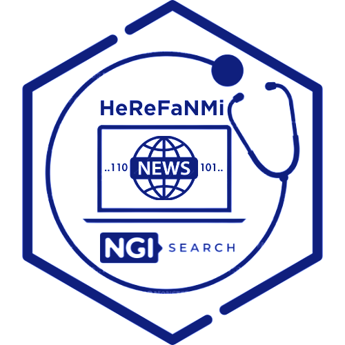

#  HeRe-FaNMi - Health-Related Fake News Mitigation

HeReFaNMi stands for Healthcare-Related Fake News Detection. It is a project funded by NGI-Search 

## context 
---
In the era of the next generation of the internet, where information flows freely and instantaneously, the challenge of combating fake news and misinformation has become even more critical. The Covid-19 pandemic has vividly demonstrated the detrimental effects of widespread dissemination of inaccurate health-related information, eroding public trust in official guidelines and posing significant obstacles to public health efforts.
