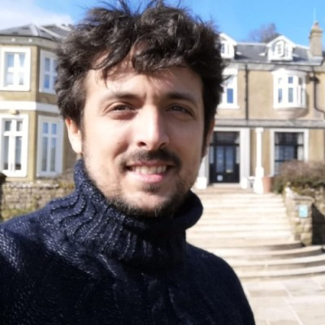

#  HeRe-FaNMi - Health-Related Fake News Mitigation

HeReFaNMi stands for Healthcare-Related Fake News Detection. It is a project funded by NGI-Search

## context 

In the era of the next generation of the internet, where information flows freely and instantaneously, the challenge of combating fake news and misinformation has become even more critical. The Covid-19 pandemic has vividly demonstrated the detrimental effects of widespread dissemination of inaccurate health-related information, eroding public trust in official guidelines and posing significant obstacles to public health efforts.

HeRe-FaNMi (Health-related Fake News Monitoring) stands at the forefront of tackling this pressing issue, fueled by the determination to combat the propagation of fake news within health-related information and restore trustworthiness to the internet community. This pioneering project is driven by recognizing the severe consequences of misinformation, including the promotion of ineffective remedies, the downplaying of risks, and the erosion of public confidence in scientific research.

At its core, HeRe-FaNMi aims to develop an autonomous system equipped with the capacity for continual learning, leveraging advanced Natural Language Processing (NLP) techniques to discriminate between genuine and deceptive medical news effectively. Utilizing cutting-edge machine learning algorithms, HeRe-FaNMi endeavors to provide individuals with an automated and reliable solution that safeguards them against misinformation while concurrently promoting the dissemination of accurate health information. By harnessing the power of technology, HeRe-FaNMi aspires to contribute to the enhancement of overall societal well-being and public health outcomes.

## Our mission

### Social goals 

- Combat the propagation of fake news within health-related information.
- Restore trustworthiness to the internet community.
- Recognize the severe consequences of misinformation, including promoting ineffective remedies, downplaying risks, and eroding public confidence in scientific research.
- Safeguard individuals against misinformation while promoting the dissemination of accurate health information.

### Technological goals
- Develop an autonomous system equipped with continual learning capabilities.
- Leverage cutting-edge machine learning algorithms to provide individuals with an automated and reliable solution.
- Harness the power of technology to enhance overall societal well-being and improve public health outcomes.

## Ethical Charter

- **Respect for Privacy**: HeRe-FaNMi is committed to upholding the privacy rights of individuals in accordance with European laws, such as the General Data Protection Regulation (GDPR). Personal data collected during the operation of the system will be handled securely and in compliance with applicable data protection regulations.
- **Transparency and Accountability**: HeRe-FaNMi will strive for transparency in its operations and decision-making processes. The project will provide clear and understandable information about its purpose, functionality, and data usage.
- **Bias and Fairness**: HeRe-FaNMi will aim to mitigate bias and ensure fairness in its algorithms and decision-making processes. The project will continually assess and address any biases that may arise, working towards equitable outcomes and avoiding discrimination or unfair treatment of individuals or groups.

## Dataset 
A link to our fine-tuned model for classifying Health-related Fake and Trustworthy News articles is given down below: 
https://huggingface.co/a-hamdi/NGILlama3-merged

---

## Team Members 

<link rel="stylesheet" href="https://cdnjs.cloudflare.com/ajax/libs/font-awesome/4.7.0/css/font-awesome.min.css">
<table  class = "center"> 
    <tr>
        <td></td>
        <td></td>
        <td></td>
    </tr>
    <tr>
        <td style ="text-align: center; vertical-align: middle">    
            <b>Aladine Chetouani</b> <br>
            Research inversigator <br>
            <a href="https://www.linkedin.com/in/aladine-chetouani-2aa66038/">
                
            </a>
            <a href=https://www.researchgate.net/profile/Aladine-Chetouani">
                
            </a>
        </td>
        <td style ="text-align: center; vertical-align: middle">    
            <b>Alessandro Bruno</b> <br>
            Head Coordinator<br>
            <a href="https://www.linkedin.com/in/alessandrobrun0/">
                
            </a>
            <a href="https://www.researchgate.net/profile/Alessandro-Bruno-3">
                
            </a>
        </td>
        <td style ="text-align: center; vertical-align: middle">    
            <b>Pier-Luigie Mazzeo</b> <br>
            Research inversigator <br>
            <a href="https://www.linkedin.com/in/pmazzeo/">
                
            </a>
            <a href="https://www.researchgate.net/profile/Pier-Luigi-Mazzeo">
                
            </a>
        </td>
    </tr>
</table>


<table class = "center" > 
        <tr>
        <td></td>
        <td></td>
    </tr>
    <tr>
        <td style ="text-align: center; vertical-align: middle">    
            <b>Mohamed Amine KERKOURI</b> <br>
            AI Researcher, Web Dev, <br> Communication<br>
            <a href="https://www.linkedin.com/in/mohamed-amine-kerkouri/">
                
            </a>
            <a href="https://www.researchgate.net/profile/Mohamed-Kerkouri-2">
                
            </a>
        </td>
        <td style ="text-align: center; vertical-align: middle">    
            <b>Marouane Tliba</b> <br>
            AI Researcher, DevOps, <br> Communication<br>
            <a href="https://www.linkedin.com/in/mtliba/">
                
            </a>
            <a href="https://www.researchgate.net/profile/Marouane-Tliba">
                
            </a>
        </td>
    </tr>
</table>


---

```bibtex
@misc{HeReFaNMI,
  author       = {Alessandro Bruno and Aladine Chetouani and Pier Luigi Mazzeo and Mohamed Amine Kerkouri and Marouane Tliba and Hamdi Abderrehmen and Walid Taib and Abdelali Ichou and Idris Saadallah},
  title        = {HeReFaNMI: Health-related Fake News Mitigation Platform},
  howpublished = {\url{https://ai-text-validator.vercel.app/}},
  year         = {2024},
  note         = {Funded by NGI Search (Next Generation Internet Discovery and Search)},
  url          = {https://github.com/alessandrobruno10/herefanmi}
}
```

